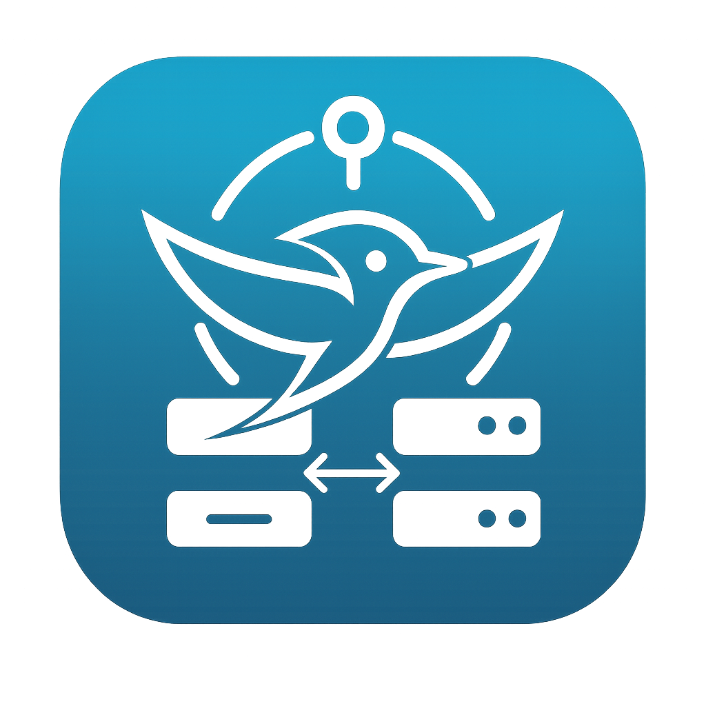

# ConnectionManagerKit

[](https://swift.org)
[](https://developer.apple.com)
[](LICENSE)

A modern, cross-platform networking framework built on SwiftNIO for managing network connections with automatic reconnection, TLS support, and comprehensive event monitoring.

## 🚀 Features

### 🔗 Cross-Platform Networking
- **Apple Platforms** - iOS 17.0+, macOS 14.0+, tvOS 17.0+, watchOS 10.0+
- **Android Support** - Android Compatability with NIO
- **Linux Support** - Linux compatibility with NIO
- **Swift 6.0+** - Latest Swift language features
- **Async/Await** - Modern concurrency throughout

### 🔄 Automatic Connection Management
- **Smart Reconnection** - Built-in retry logic with exponential backoff
- **Advanced Retry Strategies** - Fixed delay, exponential backoff with jitter, and custom retry policies
- **Parallel Connections** - Concurrent connection establishment for improved performance
- **Connection Pooling** - Efficient connection reuse with acquire/return semantics
- **Connection Caching** - LRU eviction, TTL support, and automatic cleanup
- **Graceful Shutdown** - Proper resource cleanup and termination
- **Network Monitoring** - Real-time network event tracking

### 🔐 Security & TLS
- **TLS Support** - Native TLS/SSL with customizable configurations
- **Certificate Validation** - Secure certificate handling
- **Encrypted Transport** - End-to-end encryption support
- **Security Best Practices** - Industry-standard security patterns

### 📡 Advanced Transport
- **Multi-Server Support** - Connect to multiple servers simultaneously
- **Custom Channel Handlers** - Extensible protocol support
- **Event-Driven Architecture** - Reactive network event handling
- **Performance Optimized** - High-performance networking stack

## 📦 Installation

### Swift Package Manager

Add ConnectionManagerKit to your project using Swift Package Manager:

```swift
dependencies: [
    .package(url: "https://github.com/needletails/connection-manager-kit.git", from: "1.0.0")
]
```

### Requirements

- iOS 17.0+ / macOS 14.0+ / tvOS 17.0+ / watchOS 10.0+ / Linux
- Swift 6.0+
- Xcode 15.0+ (for Apple platforms)

## 🚀 Quick Start

### 1. Create Connection Manager

```swift
import ConnectionManagerKit

let manager = ConnectionManager<ByteBuffer, ByteBuffer>()
manager.delegate = MyConnectionManagerDelegate()
```

### 2. Set Up Delegates

```swift
class MyConnectionManagerDelegate: ConnectionManagerDelegate {
    func retrieveChannelHandlers() -> [ChannelHandler] {
        return [
            LengthFieldPrepender(lengthFieldBitLength: .fourBytes),
            LoggingHandler(label: "MyApp")
        ]
    }
    
    func channelCreated(_ eventLoop: EventLoop, cacheKey: String) async {
        // Called when a channel is created for the given cache key
        print("Channel created for cache key: \(cacheKey)")
        
        // Set up connection-specific delegates if needed
        // await manager.setDelegates(
        //     connectionDelegate: connectionDelegate,
        //     contextDelegate: contextDelegate,
        //     cacheKey: cacheKey
        // )
    }
}
```

### 3. Define Server Locations

```swift
let connectionDelegate = MyConnectionDelegate()
let contextDelegate = MyChannelContextDelegate()

let servers = [
    ServerLocation(
        host: "api.example.com",
        port: 443,
        enableTLS: true,
        cacheKey: "api-server",
        delegate: connectionDelegate,
        contextDelegate: contextDelegate
    )
]
```

### 4. Connect to Servers with Advanced Retry Strategies

```swift
// Basic connection
try await manager.connect(
    to: servers,
    maxReconnectionAttempts: 5,
    timeout: .seconds(10)
)

// With exponential backoff retry strategy
try await manager.connect(
    to: servers,
    maxReconnectionAttempts: 5,
    timeout: .seconds(10),
    retryStrategy: .exponential(
        initialDelay: .seconds(1),
        maxDelay: .seconds(30),
        multiplier: 2.0,
        jitter: true
    )
)

// Parallel connections for improved performance
try await manager.connectParallel(
    to: servers,
    maxConcurrentConnections: 5,
    retryStrategy: .fixed(delay: .seconds(2))
)
```

### 5. Use Connection Pooling

```swift
// Configure connection pool
let poolConfig = ConnectionPoolConfiguration(
    minConnections: 2,
    maxConnections: 10,
    acquireTimeout: .seconds(5),
    maxIdleTime: .seconds(60)
)

// Acquire connection from pool
let connection = try await manager.connectionCache.acquireConnection(
    for: "api-server",
    poolConfig: poolConfig
) {
    // Connection factory: create new connection if needed
    return ChildChannelService<ByteBuffer, ByteBuffer>(
        logger: .init(),
        config: .init(
            host: "api.example.com",
            port: 443,
            enableTLS: true,
            cacheKey: "api-server",
            delegate: connectionDelegate,
            contextDelegate: contextDelegate
        ),
        childChannel: nil,
        delegate: manager
    )
}

// Return connection to pool
await manager.connectionCache.returnConnection(
    "api-server",
    poolConfig: poolConfig
)
```

### 6. Handle Data

```swift
class MyChannelContextDelegate: ChannelContextDelegate {
    private var writers: [String: NIOAsyncChannelOutboundWriter<ByteBuffer>] = [:]
    
    func deliverWriter<Outbound, Inbound>(context: WriterContext<Inbound, Outbound>) async {
        writers[context.id] = context.writer as? NIOAsyncChannelOutboundWriter<ByteBuffer>
    }
    
    func deliverInboundBuffer<Inbound, Outbound>(context: StreamContext<Inbound, Outbound>) async {
        if let data = context.inbound as? ByteBuffer {
            let message = String(buffer: data)
            print("Received: \(message)")
        }
    }
    
    func sendData(_ data: ByteBuffer, to channelId: String) async throws {
        guard let writer = writers[channelId] else {
            throw MyError.writerNotFound
        }
        try await writer.write(data)
    }
}
```

### 7. Graceful Shutdown

```swift
await manager.gracefulShutdown()
```

## 🌐 WebSocket APIs

High-level WebSocket client built on top of `ConnectionManagerKit` with automatic reconnection and main-actor event delivery.

### Quick Start (Client)

```swift
import ConnectionManagerKit

let client = await WebSocketClient.shared

// Connect by URL (ws / wss)
let url = URL(string: "wss://example.com/chat")!
try await client.connect(
    url: url,
    headers: ["Authorization": "Bearer <token>"]
)

// Or connect by parameters
try await client.connect(
    host: "example.com",
    port: 443,
    enableTLS: true,
    route: "/chat",
    headers: ["Sec-WebSocket-Protocol": "chat.v1"],
    retryStrategy: .exponential(initialDelay: .seconds(1), maxDelay: .seconds(30))
)

// Send frames
try await client.sendText("hello", to: "/chat")
try await client.sendBinary(Data([0x01, 0x02]), to: "/chat")

// Receive messages (main-actor observable stream)
if let messages = await client.socketReceiver.messageStream {
    Task { // observe without blocking
        for await message in messages {
            switch message {
            case .text(let string):
                print("text: \(string)")
            case .binary(let data):
                print("binary bytes: \(data?.count ?? 0)")
            case .ping: print("ping")
            case .pong: print("pong")
            default: break
            }
        }
    }
}

// Observe channel/network events
if let events = await client.socketReceiver.eventStream {
    Task {
        for await event in events {
            switch event {
            case .channelActive: print("connected")
            case .channelInactive: print("disconnected")
            case .error(let error): print("ws error: \(error)")
            default: break
            }
        }
    }
}

// Disconnect a route or shut down all
await client.disconnect("/chat")
await client.shutDown()
```

### Headers and TLS

- Pass additional HTTP headers via the `headers` parameter on `connect(...)` (e.g., `Authorization`, `Sec-WebSocket-Protocol`).
- Use `wss://` or set `enableTLS: true` to enable TLS. For advanced TLS, provide `tlsPreKeyed`.

### Heartbeats (Auto Ping/Pong)

- Enabled by default. Configure with:
  - `autoPingPong: Bool` (default true)
  - `autoPingPongInterval: TimeInterval?` (default 60s)
  - `autoPingTimeout: TimeInterval` (default 10s) – disconnects the route if a `pong` is not received in time.

See the full WebSocket quick start: [WebSocket Quick Start](Sources/ConnectionManagerKit/Documentation.docc/WebSocketQuickStart.md)

## 📚 Documentation

Comprehensive documentation is available in the [Documentation.docc](Sources/ConnectionManagerKit/Documentation.docc) directory:

- **[Getting Started](Sources/ConnectionManagerKit/Documentation.docc/GettingStarted.md)** - Quick setup guide
- **[Basic Usage](Sources/ConnectionManagerKit/Documentation.docc/BasicUsage.md)** - Common usage patterns
- **[API Reference](Sources/ConnectionManagerKit/Documentation.docc/Documentation.md)** - Complete API documentation
- **[WebSocket Quick Start](Sources/ConnectionManagerKit/Documentation.docc/WebSocketQuickStart.md)** - `WebSocketClient` usage and events

### Building Documentation

```bash
# Using Swift Package Manager
swift package generate-documentation

# Using Xcode
# Product > Build Documentation
```

## 🔧 Configuration

### Connection Pooling and Caching

```swift
// Configure connection cache with LRU eviction and TTL
let cacheConfig = CacheConfiguration(
    maxConnections: 50,
    ttl: .seconds(300),  // 5 minutes TTL
    enableLRU: true      // Enable LRU eviction
)

// Configure connection pool
let poolConfig = ConnectionPoolConfiguration(
    minConnections: 2,           // Maintain at least 2 connections
    maxConnections: 20,          // Maximum 20 connections
    acquireTimeout: .seconds(10), // 10 second timeout
    maxIdleTime: .seconds(60)    // Close idle connections after 1 minute
)
```

### Multiple Server Connections

```swift
let servers = [
    ServerLocation(
        host: "api1.example.com",
        port: 443,
        enableTLS: true,
        cacheKey: "api-server-1",
        delegate: connectionDelegate,
        contextDelegate: contextDelegate
    ),
    ServerLocation(
        host: "api2.example.com",
        port: 443,
        enableTLS: true,
        cacheKey: "api-server-2",
        delegate: connectionDelegate,
        contextDelegate: contextDelegate
    )
]

try await manager.connect(
    to: servers,
    maxReconnectionAttempts: 3,
    timeout: .seconds(15)
)
```

### Advanced Retry Strategies

```swift
// Fixed delay retry
try await manager.connect(
    to: servers,
    retryStrategy: .fixed(delay: .seconds(5))
)

// Exponential backoff with jitter
try await manager.connect(
    to: servers,
    retryStrategy: .exponential(
        initialDelay: .seconds(1),
        multiplier: 2.0,
        maxDelay: .seconds(30),
        jitter: true
    )
)

// Custom retry strategy
try await manager.connect(
    to: servers,
    retryStrategy: .custom { attempt, maxAttempts in
        if attempt >= 3 {
            return .seconds(0) // Stop retrying after 3 attempts
        }
        return .seconds(Int64(pow(2.0, Double(attempt))))
    }
)
```

### Custom Channel Handlers

```swift
class MyConnectionManagerDelegate: ConnectionManagerDelegate {
    func retrieveChannelHandlers() -> [ChannelHandler] {
        return [
            LengthFieldPrepender(lengthFieldBitLength: .fourBytes),
            MyProtocolHandler(),
            LoggingHandler(label: "MyApp")
        ]
    }
}
```

### TLS Configuration

```swift
class MyTLSListenerDelegate: ListenerDelegate {
    func retrieveSSLHandler() -> NIOSSLServerHandler? {
        do {
            let tlsConfig = TLSConfiguration.makeServerConfiguration(
                certificateChain: [.certificate(certificate)],
                privateKey: .privateKey(privateKey)
            )
            let sslContext = try NIOSSLContext(configuration: tlsConfig)
            return try NIOSSLServerHandler(context: sslContext)
        } catch {
            print("Failed to create SSL handler: \(error)")
            return nil
        }
    }
}
```

## 🏗️ Architecture

ConnectionManagerKit is built with a modular architecture:

```
ConnectionManagerKit/
├── Connection/       # Connection management
├── Listener/        # Server-side listening
├── Handlers/        # Network event monitoring
└── Helpers/         # Models and protocols
```

### Key Components

- **ConnectionManager** - Client-side connection management
- **ConnectionListener** - Server-side connection acceptance
- **ConnectionCache** - Efficient connection storage with LRU and TTL
- **NetworkEventMonitor** - Network event tracking
- **ChannelService** - Channel lifecycle management

## 🔄 Connection Management

### Automatic Reconnection

```swift
// Configure reconnection settings
try await manager.connect(
    to: servers,
    maxReconnectionAttempts: 5,  // Maximum retry attempts
    timeout: .seconds(10)         // Connection timeout
)
```

### Network Event Monitoring

```swift
class MyConnectionDelegate: ConnectionDelegate {
    func handleNetworkEvents(_ stream: AsyncStream<NetworkEventMonitor.NetworkEvent>, id: String) async {
        for await event in stream {
            switch event {
            case .viabilityChanged(let update):
                print("Connection \(id) viability: \(update.isViable)")
            case .betterPathAvailable(let path):
                print("Better path available for \(id)")
            case .waitingForConnectivity(let error):
                print("Waiting for connectivity: \(error)")
            default:
                break
            }
        }
    }
}
```

### Graceful Shutdown

```swift
class MyApp {
    let manager = ConnectionManager<ByteBuffer, ByteBuffer>()
    
    func shutdown() async {
        // Trigger graceful shutdown
        await manager.gracefulShutdown()
        
        // Wait for shutdown to complete
        while await manager.shouldReconnect {
            try? await Task.sleep(until: .now + .milliseconds(100))
        }
        
        print("Shutdown complete")
    }
}
```

## 🧪 Testing

Run the test suite:

```bash
swift test
```

The framework includes comprehensive unit tests covering:

- Connection management with real networking
- Server listening
- TLS configuration
- Network event handling
- Error scenarios
- Graceful shutdown
- Connection pooling
- Retry strategies
- Parallel connections

## 📄 License

This project is licensed under the MIT License - see the [LICENSE](LICENSE) file for details.

## 🤝 Support

- **Documentation**: [Documentation.docc](Sources/ConnectionManagerKit/Documentation.docc)
- **Issues**: [GitHub Issues](https://github.com/needletails/connection-manager-kit/issues)

## 🏢 Enterprise

ConnectionManagerKit is designed for production use with:

- **Production-Ready** - Battle-tested networking framework with real networking tests
- **High Performance** - Optimized for high-throughput applications
- **Reliability** - Robust error handling and recovery
- **Scalability** - Designed for large-scale deployments
- **Connection Pooling** - Efficient resource management
- **Advanced Retry Logic** - Configurable retry strategies for different scenarios

## 🔗 Related Projects

- [DoubleRatchetKit](https://github.com/needletails/double-ratchet-kit) - Double Ratchet Algorithm with Post-Quantum X3DH (PQXDH) integration
- [Post Quantum Solace](https://github.com/needletails/post-quantum-solace) - Post-Quantum cryptographic messaging SDK
- [NeedleTailIRC](https://github.com/needletails/needletail-irc) - IRC transport layer

## 🤝 Contributing

We welcome contributions! Please see our [Contributing Guidelines](CONTRIBUTING.md) for details.

### Development Setup

1. Clone the repository
2. Open `Package.swift` in Xcode
3. Build and run tests
4. Make your changes
5. Submit a pull request

---

**Built with ❤️ by the NeedleTails Team** 
